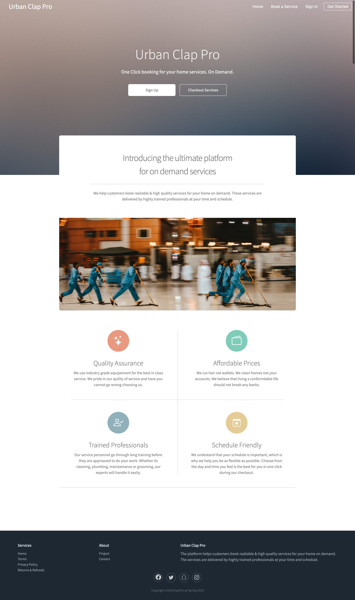
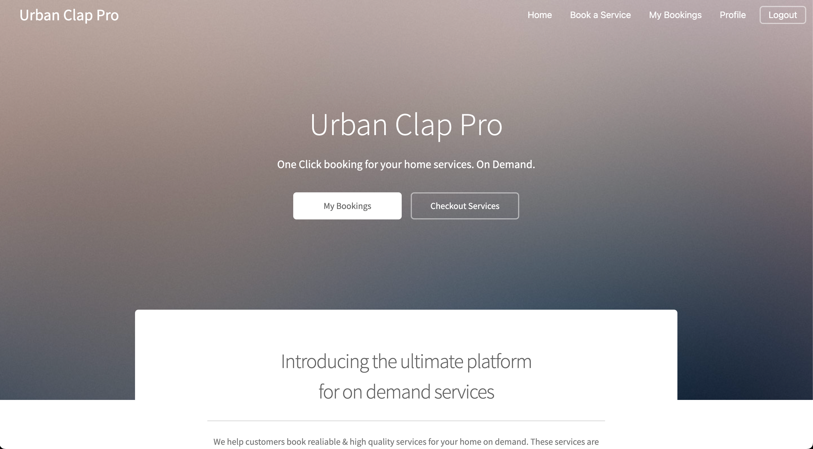
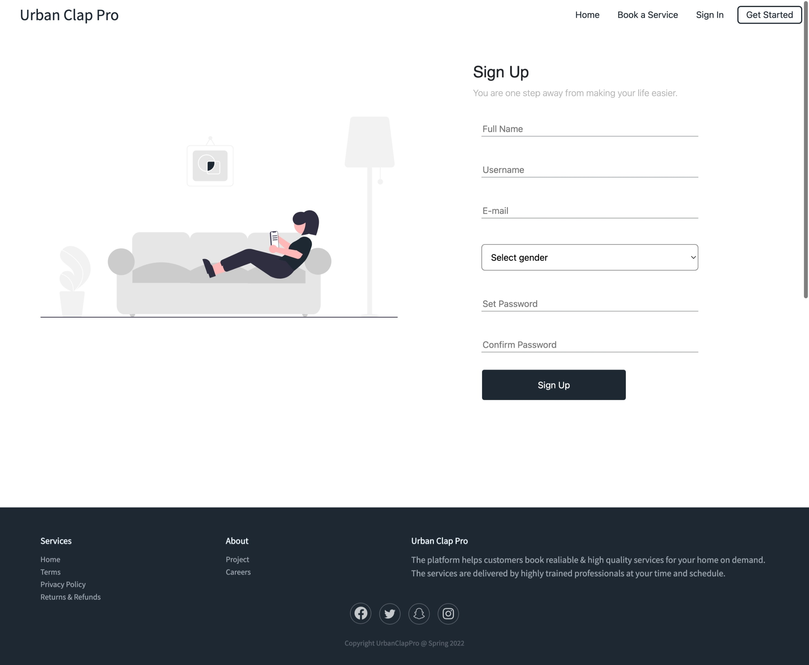
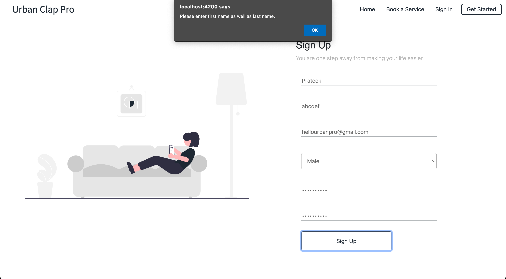
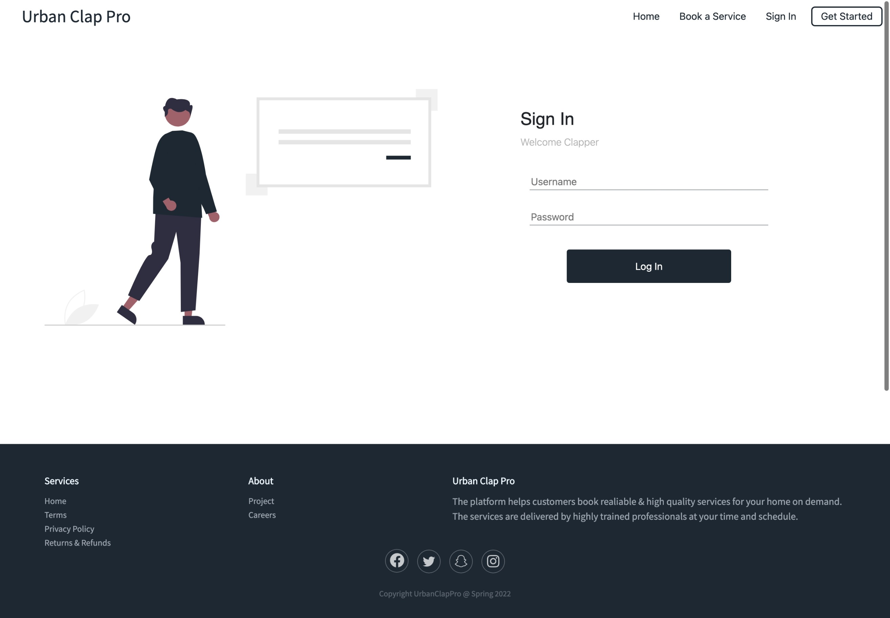
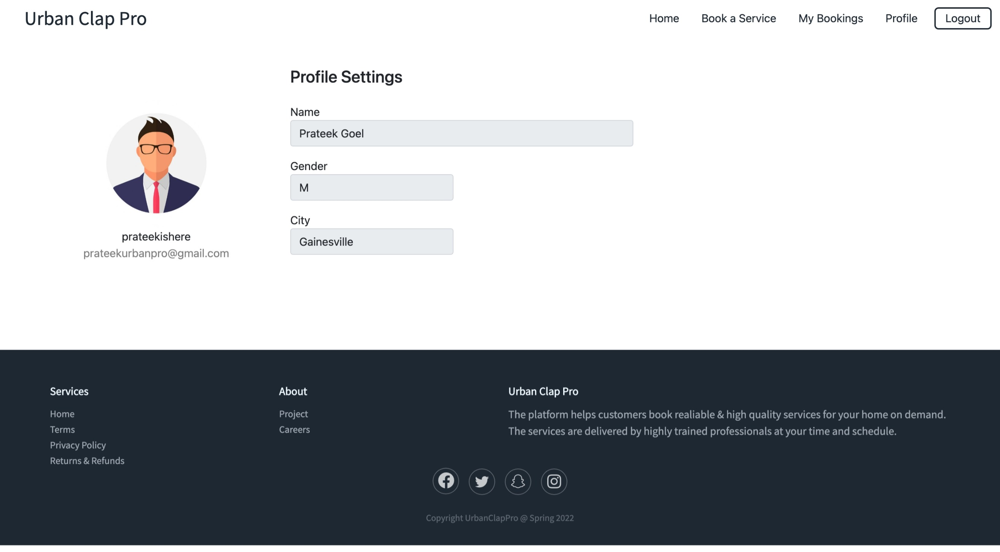
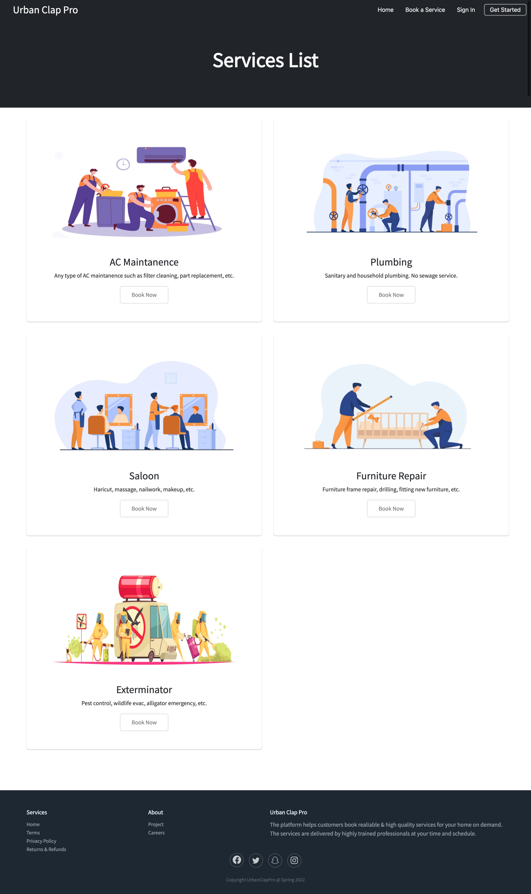
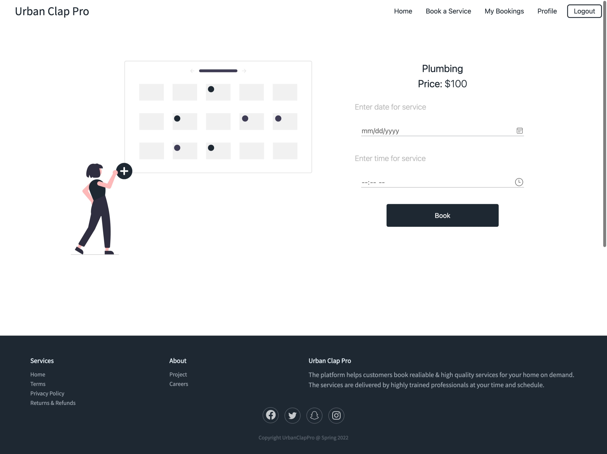
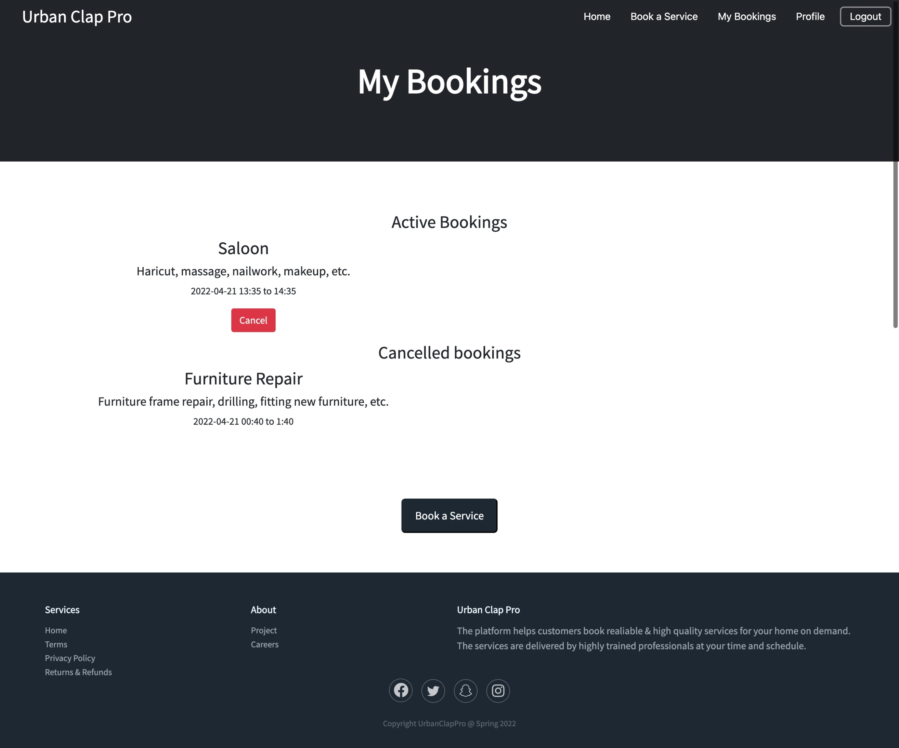

# UrbanClapClone

<b>Course</b>: CEN5035 - Software Engineering <br>
<b>Institute</b>: Unviersity of Florida <br>
<b>Semester</b>: Spring 2022 <br>
<b>Instructor</b>: Dr. Alin Dobra <br>
<b>Team</b>: 
* Prateek Kumar Goel ([Github](https://github.com/pkgprateek)) - Both
* Rishabh Jaiswal ([Github](https://github.com/rsj-rishabh)) - Both
* Raghunandhan Vaidy ([Github](https://github.com/Skillic-Kaiser)) - Both
* Madhuri Uppu ([Github](https://github.com/MadhuriUppu)) - Both

## Project Description:
The <strong>“UrbanClapPro"</strong> web application aims to aggregate utility services such as beauty, electrical mainatainance, home cleaning, pest control etc. The application would enable the end-user to select their preferred service, book an appointment at a convenient time, pay the resultant charge and give feedback. The primary criterion of the web application would facility easy calenter and time slot booking to book the services according to your time and availability. The application aims to be a one stop shop that caters to all the utility needs for the end user. Out product promises easy bookign and cancellation without extra changes and you can maintain your booked services at one places easily. 

#

## Technology Stack:
* Framework : Angular
* Backend : GoLang
* Database : MySQL (GORM Library)
* Version Control: Git
* Code Editor : Visual Studio Code

#

## Development Methodology:
* Each contributor pushes code in their own branch (mostly named after them).
* A pull request is created to merge the code to `dev-{name}` branch which is our development branch.
* After each sprint, the final code is merged with `main` branch which is our final working product.
* A checkpoint branch is also created after each sprint for the purpose of tracking changes between two sprints.

#

## Sprint 4 Deliverables:

The deliverables for this sprint can be found by visiting : https://github.com/rsj-rishabh/urbanClapClone/blob/master/Sprint4.md

#

## Project Board:

Link : https://github.com/rsj-rishabh/urbanClapClone/projects/1

#

## API Documentation:
Link : https://github.com/rsj-rishabh/urbanClapClone/blob/master/API%20Documentation.md

#

## Deployment:

Frontend Link: https://urban-clap-pro.netlify.app/

#

## Demo (Fuctionality Video):


https://user-images.githubusercontent.com/16275122/164362430-5eb46987-dc7d-4a94-98bf-148e63f1d99f.mp4


#

## Cypress Test (Video):


https://user-images.githubusercontent.com/16275122/164958069-fc150286-50e5-4800-b307-08b237f611b6.MP4


#

## Backend Unit Test (Video):

https://user-images.githubusercontent.com/16275122/164350003-f6675c66-d9b5-4100-8a9d-f96ca3acac1f.mp4

#

## Running Backend Server:
* Clone the repository
```
git clone https://github.com/rsj-rishabh/urbanClapClone.git
```
* Make sure you have mysql installed and correctly set up.
* Create a new database in MySQL called "urbanClap" using:
```
mysql -u root -p
```
Enter mysql password, then run:
```
create database urbanClap;
```
* Goto config.go and update your mysql password
```
cd server/config/
code config.go
```
* Now navigate to server folder and run go server:
```
cd ./server/
go run main.go
```
Ignore any errors as it will check for required datatables (show the error), then automatically creates the datatables.

#

## Running Frontend Server:
* Clone the repository
```
git clone https://github.com/rsj-rishabh/urbanClapClone.git
```
* Install NodeJS LTS version from https://nodejs.org/en/ for your Operating System.
* Navigate to client folder and install required libraries:
```
cd ./client/
npm install
```
* In case of any error run audit and install once more:
```
npm audit fix --force && npm install
```
* Run the Angular Server:
```
npm start
```

#

## Demo (Project Screenshots):

1. Home - Landing (logged out)


<br><br>

2. Home - Landing (logged in)


<br><br>

3. Signup


<br><br>

3. Signup (Validation)


<br><br>

5. Signin


<br><br>

6. Profile


<br><br>

7. Service List


<br><br>

8. Service Scheduling


<br><br>

9. Bookings


<br><br>
