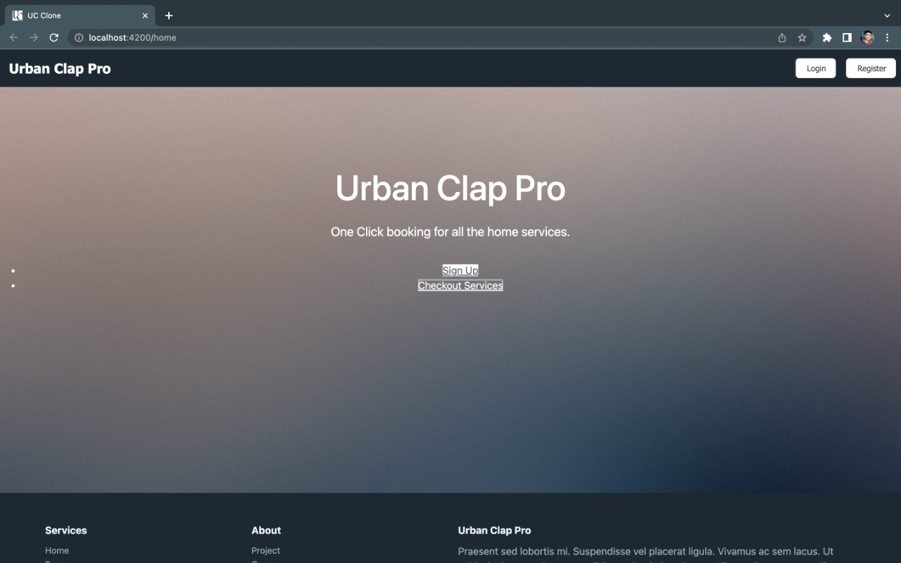

# Sprint - 3

## User stories (Goal):

The user stories selected to run through the first sprint cycle are:
* As a user, browse the service list
* As a user, I want to choose the date and time of service
* As a user, logout from the application succesfully.
* As a user I want to chech my bookings

#

## Responsibilities: 
* Prateek Kumar Goel ([Github](https://github.com/pkgprateek)) - Frontend
* Rishabh Jaiswal ([Github](https://github.com/rsj-rishabh)) - Frontend
* Raghunandhan Vaidy ([Github](https://github.com/Skillic-Kaiser)) - Backend
* Madhuri Uppu ([Github](https://github.com/MadhuriUppu)) - Backend

#

## Running the Project:
Please check the root [repository description](https://github.com/rsj-rishabh/urbanClapClone) or main [README.md](https://github.com/rsj-rishabh/urbanClapClone/blob/master/README.md) for detailed instructions on installation and runninng the project successfully.

#

## Sprint Requirements (Review):
Frontend:
1.	Landing UI
2.	Service Grid
3.	Bookings Page
4.	Bookings Checkout
5.  Client Side Form Validation
6.  New Footer Design
7.  Refactoring Header & Footer

Backend:
1.	Reconfiguring API routes for Checkout
2.	Test Cases for Booking Services
3.  User Authentication Security Check

Additional Note:
All APIs are RESTful and contain 4 major endpoints (CRUD) create, read, update and delete. The Backend uses POST and GET and all the data is parsed in JSON.

#

## Sprint Status (Accomplished):

- Fixed Navigation bar responsiveness
- Updating clientside file structure for shared components
- Added Login API validation client and server
- Restyling Register and Login Components
- Designed Example Service grid
- Integrated API service list in Example Service Page
- Added Booking Component
- Developed calender and time option for service booking
- Added Header Hero
- Added new footer design
- Created Automation: Github actions for Angular
- Fixed CSS image fetching errors
- Logout system fixed
- New API Documentation Added
- Implemented APIs for service with Filters
- Cancelled Bookings API implemented

#

## Sprint 3 Future Considerations:
- SVG images are broken and needs to be fixed at various places including login/register
- Order History / My Booking needs to be styled
- Routing needs to be completed for footer
- Content grid is missing on landing due to an error & will be resolved
- Profile Page needs to be implemented
- Complete Application flow will be tested use End-User's Perspective
- Some security considerations will be take n care-off in last sprint
- Some more end-to-end and unit tests will be added

#

## Demo (Screenshots):

1. Home - Landing

  

2. Home - Footer

  

3. SignIn - Page

  

4. SignIn - Validation

  

5. SignUp - Page

  

6. SignUp - Validation

  

  

7. Services List

  

8. Service Booking - Date & Time

  

  

9. Booking Confirmation - Alert

#

## API Endpoints:
This has been shifted to new and detailed [API documentation.md](https://github.com/rsj-rishabh/urbanClapClone/blob/master/API%20Documentation.md)
